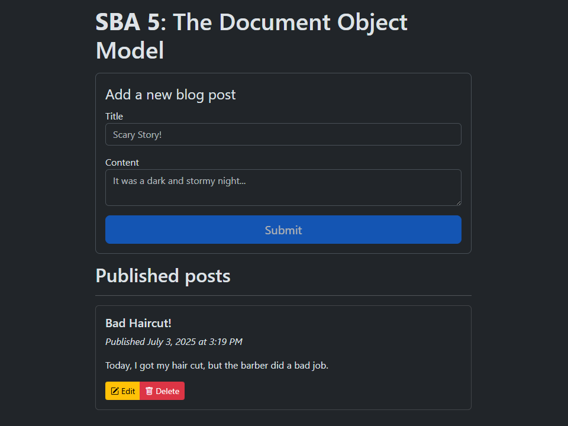

# SBA 5: The Document Object Model

[Karl Johnson](https://github.com/hirekarl)  
2025-RTT-30  
<time datetime="2025-07-03">2025-07-03</time>  

## Overview
### Viewer Instructions
Go to [glistening-tulumba-56567c.netlify.app/personal-blog-sba](https://glistening-tulumba-56567c.netlify.app/personal-blog-sba/) to view the app in deployment; view submission source code below.

### Submission Source
- **HTML**: [`./personal-blog-sba/index.html`](./personal-blog-sba/index.html)
- **JavaScript**: [`./personal-blog-sba/script.js`](./personal-blog-sba/script.js)
- **CSS**: [`./personal-blog-sba/styles.css`](./personal-blog-sba/styles.css)

### Reflection
Reflect on your development process, challenges faced, and how you overcame them.
> This was pretty straightforward, mostly! When all was said and done, `script.js` was very long, and it was helpful&mdash;both for my sanity, and hopefully, for the legibility and comprehensibility of the codebase as a whole&mdash;to modularize. I also found I was repeating myself a lot in the form field event handlers, so I abstracted those functions into a `handleField()` function.
> 
> The tricky things were:
> - finagling the modal
> - handling the case where the user enters only white space in an `<input>` or `<textarea>` field
> - handling the case where the user clicks on the Bootstrap icon inside a post's "Edit" or "Delete" button
>
> Regarding the modal, I kept having an issue where the form fields wouldn't populate properly with the values associated with the associated post's title or content. They'd carry over from the last interaction with the modal form, and/or the Bootstrap form validation utility classes wouldn't properly clear. I fixed it by manually resetting the form, clearing the values, and removing all the form validation utility classes on form submission and modal close. I also had to do research on proper usage of the `was-validated` utility class.
>
> I initially tried to fix the white space case by setting `pattern` attribute on the `<input>` and `<textarea>`s, and it took me a while to realize that `<textarea>`s can't use the `pattern` attribute. Then, I tried to implement an explicit match test on the field values, but my implementation would continue to report the white space error even when non-white space characters were entered (probably a regexp skill issue). In the end, it was easier and more effective to test whether the value gives a truthy value *and* results in an empty string when `.trim()` is applied.
>
> The last tricky issue had to do with capturing and bubbling: if the user clicked directly on an `<i>` tag containing a Bootstrap icon, the event on its parent `<button>` wouldn't fire. I fixed it by targeting the `.closest("button")` instead. Then, the script kept throwing an error when I clicked in the `postsContainer` outside of a button; I fixed this by wrapping the delegated event handlers for the buttons in an `if` statement that tests whether `closestButton` gives a truthy value.
>
> It also took me a little while to figure out how to properly disable the main "Submit" button when the associated form fields were valid. Then I realized I could just test whether the form itself reports validity when `.checkValidity()` is called and attach it to an `input` event listener on its parent form.

## Assignment Instructions
In this Skills-Based Assessment (SBA), you will develop an “Interactive Personal Blog Platform” from scratch.

This project will test your ability to manipulate the DOM, handle user events, implement form validation, and utilize `localStorage` for data persistence.

The primary focus is on client-side JavaScript functionality to create a dynamic and interactive web application. While the appearance of the application is important, the focus is on the JavaScript functionality, so do not spend too much time on styling.

### Scenario
Imagine you are building a personal project: a simple, client-side only blog or journal platform. You want to be able to quickly jot down thoughts, save them, view them later, and manage your entries directly in your browser without needing a backend database. The application should be user-friendly and provide a seamless experience for managing your posts.

### Requirements
Your Interactive Personal Blog Platform must include the following features:

#### 1. Create New Posts:
- [x] A form with fields for a post title and post content (e.g., using `<input type="text">` for title and `<textarea>` for content).
- [x] Upon submission, the new post should be added to a list of posts displayed on the page.
- [x] The form should be validated: both title and content are required.
- [x] Display custom, user-friendly error messages if validation fails.

#### 2. Display Posts:
- [x] All created posts should be displayed on the page. Each displayed post should clearly show its title and content.
- [x] Posts should be rendered dynamically using JavaScript.

#### 3. Edit Posts:
- [x] Each displayed post should have an “Edit” button.
- [x] Clicking “Edit” should allow the user to modify the title and content of that specific post. This might involve populating the main form (or a modal form) with the existing post data.
- [x] After editing, the updated post should be reflected in the display.
- [x] Form validation should also apply during editing.

#### 4. Delete Posts:
- [x] Each displayed post should have a “Delete” button.
- [x] Clicking “Delete” should remove the post from the display and from `localStorage`.

#### 5. Data Persistence with `localStorage`:
- [x] All blog posts (title, content, and perhaps a unique ID and timestamp you generate) must be saved in `localStorage`.
- [x] When the page is loaded or refreshed, any posts previously saved in `localStorage` should be retrieved and displayed.
- [x] Updates (from edits) and deletions must also be reflected in `localStorage`.